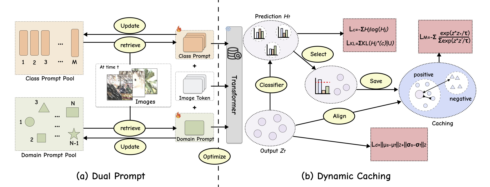

## Dual Prompt Coreset with Memory for Continual Test-Time Adaptation
## Overview



## Experiments

### Environment
```bash
conda create -n CTTA python==3.9.7
conda activate CTTA
pip install torch==2.1.1 torchvision==0.16.1 torchaudio==2.1.1 --index-url https://download.pytorch.org/whl/cu121
pip install -r requirements.txt

### Data

+ ImageNet-C [Download](https://zenodo.org/record/2235448#.Yj2RO_co_mF)
+ Cifar10-to-Cifar10-C [Automatic Download]
+ Cifar100-to-Cifar100-C [Automatic Download]

### Source Model

+ ImageNet-to-ImageNet-C: you can load the source model from timm.
+ Cifar10-to-Cifar10-C: you can load the source model from [here](https://drive.google.com/file/d/1pAoz4Wwos74DjWPQ5d-6ntyjQkmp9FPE/view?usp=sharing).
+ Cifar100-to-Cifar100-C: you can load the source model from [here](https://drive.google.com/file/d/1yRekkpkIdwX_LFsOh4Ba9ndaECnY-UC-/view?usp=sharing).


### Training and Evaluation
```bash
bash bash/imagenet.sh


## Acknowledgements
Our code is based on the PyTorch implementation of the following projects:
- [KFF](https://github.com/zhoujiahuan1991/NeurIPS2025-KFF)
- [CoTTA](https://github.com/qinenergy/cotta) 
- [ViDA](https://github.com/Yangsenqiao/vida) 
- [DPCore](https://github.com/yunbeizhang/DPCore) 
- [Robustbench](https://github.com/RobustBench/robustbench)
